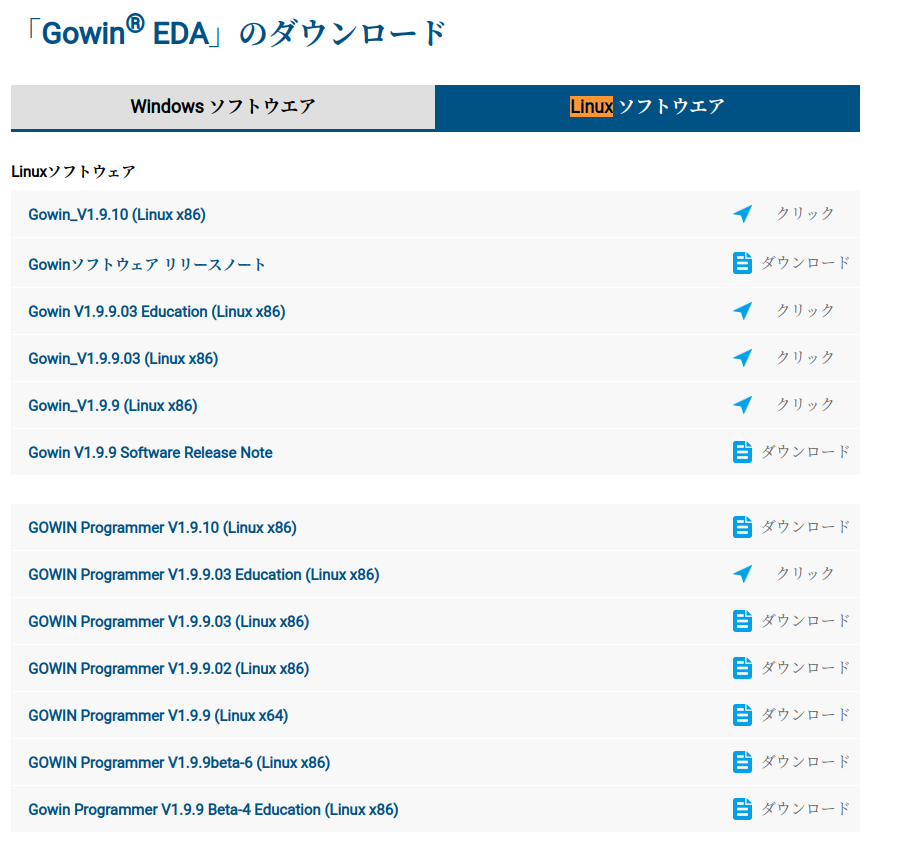

GowinのFPGAが使いたくなったのでIDEのインストールを行った。
# Gowin IDEの環境構築
## ダウンロードとインストール
GowinEDAのインストールを行う。GowinのIDEにはWindows向けのものと、Linux向けのものが存在する。Windows向けに関する情報は[Qiitaの記事](https://qiita.com/yosiaki/items/2e635e115ecedabecc35)を参照されたし。
ちなみに本記事で紹介するGOWIN IDEのバージョンはv1.9.10である。

私が使っているLinuxはUbuntuであるのでLinux用のIDEをインストールする。ソフトウェアは[Gowin](https://www.gowinsemi.com/ja/support/download_eda/)からダウンロードすることができる。このときにアカウントを作る必要があるので、最初にアカウントを作る。このアカウントは後々ライセンスのダウンロードに使うので捨てないように。



私は一番上に書いてあるモノをダウンロードする。ダウンロードしたファイルを解凍すると色々ファイルが出てくるが、**Gowin_V1.9.10_linux/IDE/doc**に日本語マニュアルが存在する。
サポート対象には
- Centos 6.8/7.0/7.3/7.5/8.2 (64-bit)
- Ubuntu 18.04/20.04/22.04 LTS

が含まれるが、私の環境はUbuntu 22.04である。

このドキュメントには色々書いてあるが[インストールマニュアル](https://cdn.gowinsemi.com.cn/SUG501J.pdf)へのリンクが書いてあったので、コレを見る。Linuxに関する情報はWindowに比べると随分少ないが、Linuxにインストールする場合、インストーラを起動する必要は無く、解凍したフォルダを配置するだけで良さそうである。なのでダウンロードtar.gzファイルをインストールしたいディレクトリに移動して、以下のコマンドで解凍するだけで良い。
```bash
tar -zxvf *tar.gz
```
## ライセンスの取得
起動するとライセンスが要求される。マニュアルによるとライセンスは、色々種類があるらしいが、今回はローカルで動作するMACアドレスを登録するタイプのライセンスを使う。ライセンス申請は[申請フォーム](https://www.gowinsemi.com/ja/support/license/)から行うことができる。

個人情報を打ち込んだあと、フォームをsubmitする。

すると、~~面倒なことにライセンスが送られてくるのは翌日である。~~ こういう感じのメールが送られてくる。


このメールにライセンスが添付されているので **~/Gowin_V1.9.10_linux/Gowin_license**にライセンスファイルを配置した。

## ライセンスの読み込み
このライセンスファイルを **/Gowin_V1.9.10_linux/IDE/bin**に存在する**gw_ide**を起動して読み込ませる。


saveを押して一度閉じたあとに、再度起動すると以下のような画面が現れたら、おそらくインストールは成功している


# サンプルプロジェクトの実行
私が所有しているデバイスはTannano9Kなのだが、TangNanoはSipeedが作った基盤ででありSipeedにより[サンプル](https://wiki.sipeed.com/hardware/en/tang/Tang-Nano-9K/Nano-9K.html)が配布されている。とりあえずこのページに存在するLED[チュートリアル](https://wiki.sipeed.com/hardware/en/tang/Tang-Nano-9K/examples/led.html)を進める。

## プロジェクト作成
Verilogを記述してゆく前にプロジェクトを作成する。基本的に他のFPGAの開発環境と同様にプロジェクトマネージャーから自分の使っているでデバイスを選択すれば良い。今回の環境はTangNano20Kであるので**GW2AR-LV18QN88C8/I7**を選択すれば良い。


デバイスを選択してプロジェクトを選択すると以下のような画面がDesignSummaryタブに表示される。選択したデバイスやプロジェクトに関する情報はこのタプで確認できるようである。


ウィンドウ上部のバーの**File**から今度はVerilogファイルを作成する。


とりあえずLED.vという名前で保存する。


### Verilogファイル
Sipeedのページに載っていた[カウンター](https://wiki.sipeed.com/hardware/en/tang/Tang-Nano-9K/examples/led.html)を動かすことを目標とします。src/LED.vに**module led** を書き込んでください。このmodle_ledは負論理のリセットですが、TangNanoのスイッチは正論理になっているので以下の2つの要素を変更する。回路図は[Sipeedのサイト](https://dl.sipeed.com/shareURL/TANG/Nano_20K/2_Schematic)からダウンロード可能であるので、今後、周辺回路を接続する場合は適宜参照す。

- negedge sys_rst_n →　posedge sys_rst_n
- !sys_rst_n →　sys_rst_n

ココで一度下の図のようにSynthesizeを実行しておく。


### Constrainファイルの作成
FPGAではVerilogで開発した回路と、実際のFPGAのパッケージ上におけるピンを関連付けする必要がある。この定義ファイルをConstrainファイルという。Constrainファイルでは実際のIOの入出力の方向や、IOの電圧、プルアップの有無などを設定することが可能である。


左のProcessから**FloorPlannner**を選択しするとフロアプランナーが起動する。このウィンドウを使って実際のパッケージ上のIOピンの上に下のテーブルの信号をドラッグアンドドロップすることでContrainファイルが生成される。


とりあえず今回のプロジェクトでは以下のようなConstrainファイルを生成した。しかしながら以下のファイルはクロックラインが普通のGPIOになっていて警告が出るのでどうにか改善したい。
```
//Copyright (C)2014-2024 Gowin Semiconductor Corporation.
//All rights reserved. 
//File Title: Physical Constraints file
//Tool Version: V1.9.10
//Part Number: GW2AR-LV18QN88C8/I7
//Device: GW2AR-18
//Device Version: C
//Created Time: Sun 07 28 00:43:22 2024

IO_LOC "led[5]" 20;
IO_PORT "led[5]" IO_TYPE=LVCMOS18 PULL_MODE=UP DRIVE=8 BANK_VCCIO=1.8;
IO_LOC "led[4]" 19;
IO_PORT "led[4]" IO_TYPE=LVCMOS18 PULL_MODE=UP DRIVE=8 BANK_VCCIO=1.8;
IO_LOC "led[3]" 18;
IO_PORT "led[3]" IO_TYPE=LVCMOS18 PULL_MODE=UP DRIVE=8 BANK_VCCIO=1.8;
IO_LOC "led[2]" 17;
IO_PORT "led[2]" IO_TYPE=LVCMOS18 PULL_MODE=UP DRIVE=8 BANK_VCCIO=1.8;
IO_LOC "led[1]" 16;
IO_PORT "led[1]" IO_TYPE=LVCMOS18 PULL_MODE=UP DRIVE=8 BANK_VCCIO=1.8;
IO_LOC "led[0]" 15;
IO_PORT "led[0]" IO_TYPE=LVCMOS18 PULL_MODE=UP DRIVE=8 BANK_VCCIO=1.8;
IO_LOC "sys_rst_n" 88;
IO_PORT "sys_rst_n" IO_TYPE=LVCMOS18 PULL_MODE=UP BANK_VCCIO=1.8;
IO_LOC "sys_clk" 4;
IO_PORT "sys_clk" IO_TYPE=LVCMOS18 PULL_MODE=UP BANK_VCCIO=1.8;
```
### バイナリの生成
設計した回路を論理合成し、バイナリにする。PrcessサブウィンドウのProcessタブkara
Place&Routeを行うことにより、書き込み用のファイルを生成する。


## ビットファイルの書き込み
Tangnano 20Kに生成したビットファイルを書き込む、私の環境ではIDEのプログラマが上手く起動しなかったため、CLIツールを使って書き込む方法を紹介する。

### 書き込みツールのビルド
[書き込みツール](https://wiki.sipeed.com/hardware/en/tang/Tang-Nano-Doc/flash-in-linux.html)のリンクからファイルをダウンロードする。

こんな感じでビルドが出来ます。
```bash
# ビルドに必要な依存関係のあるパッケージをダウンロードする
sudo apt-get install libftdi1-2 libftdi1-dev libhidapi-hidraw0 libhidapi-dev libudev-dev zlib1g-dev cmake pkg-config make g++
# gitリポジトリからソースコードをダウンロードしてコンパイルする。
git clone https://github.com/trabucayre/openFPGALoader.git
cd openFPGALoader
mkdir build
cd build
# CMAKEの設定
cmake ../ # add -DBUILD_STATIC=ON 安定版をビルドする
          # add -DENABLE_UDEV=OFF udebサポートを無効化する
          # add -DENABLE_CMSISDAP=OFF MSISDAPのサポートを無効化する
cmake --build .
# インストール
sudo make install
```

ビルド下ばかりでは権限やらなんやらが設定出来ていいないので、設定する。
```bash
#  openFPGAloader/に移動する。ビルドが終わったあとであれば、buildディレクトリに居るはず
# UDEV設定を適切なディレクトリに移動させる。
sudo cp 99-openfpgaloader.rules /etc/udev/rules.d/
# usev設定をリロードして再読込を行う。
sudo udevadm control --reload-rules && sudo udevadm trigger # 新しいルールを使うように設定する
# 現在のユーザーでスーパーユーザーじゃなくても実行可能にする
sudo usermod -a $USER -G plugdev # 
```

### 書き込み
ファイルを書き込みます。まず、Tangnano 20KをUSBでパソコンにつなぐ。
つないだ状態で以下のコマンドを実行すると、接続されていることが確認できます。以下の私の環境での実行例を示します。
```bash
./openFPGALoader --detect
empty
No cable or board specified: using direct ft2232 interface
Jtag frequency : requested 6.00MHz   -> real 6.00MHz  
index 0:
	idcode 0x81b
	manufacturer Gowin
	family GW2A
	model  GW2A(R)-18(C)
	irlength 8
```
デバイスが接続出来ていることが確認できたら、以下のように実行してデバイスにfsファイルを書き込みます。

```bash
./openFPGALoader -b  tangnano20k -f ~/Documents/GowinSDK/LED_Project/LED_project/impl/pnr/LED_project.fs 
empty
write to flash
Jtag frequency : requested 6.00MHz   -> real 6.00MHz  
Parse file Parse /home/toriten/Documents/GowinSDK/LED_Project/LED_project/impl/pnr/LED_project.fs: 
Done
DONE
after program flash: displayReadReg 00006020
	Memory Erase
	Done Final
	Security Final
Erase SRAM DONE
Jtag probe limited to %d MHz6000000
Jtag frequency : requested 10.00MHz  -> real 6.00MHz  
JEDEC ID: 0xef4017
Detected: Winbond W25Q64 128 sectors size: 64Mb
JEDEC ID: 0xef4017
Detected: Winbond W25Q64 128 sectors size: 64Mb
RDSR : 0x00
WIP  : 0
WEL  : 0
BP   : 0
TB   : 0
SRWD : 0
00000000 00000000 00000000 00
start addr: 00000000, end_addr: 00090000
Erasing: [==================================================] 100.00%
Done
Writing: [==================================================] 100.00%
Done
```

## その他

今回紹介した以外にも様々なサンプルコードが以下のリポジトリからダウンロードできる。
[Example](https://github.com/sipeed/TangPrimer-20K-example)