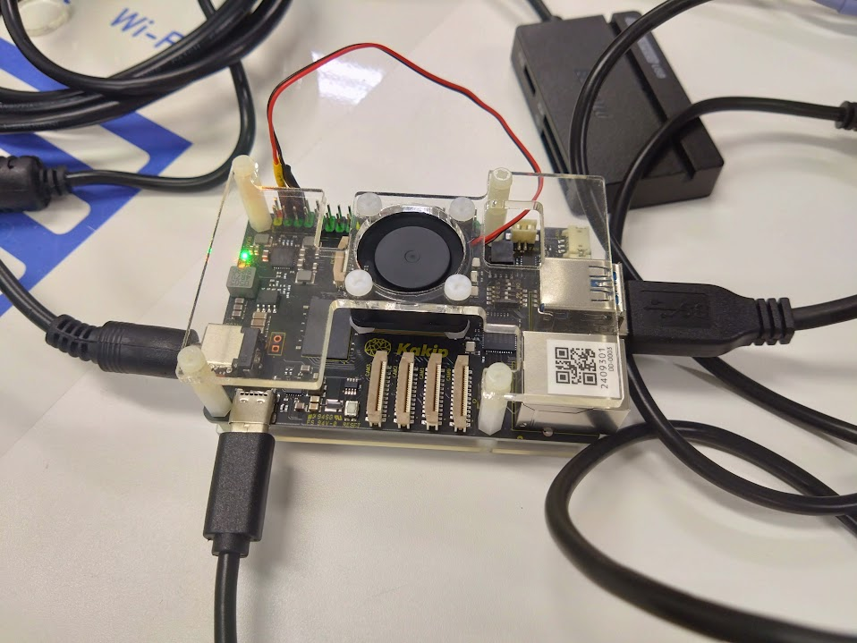
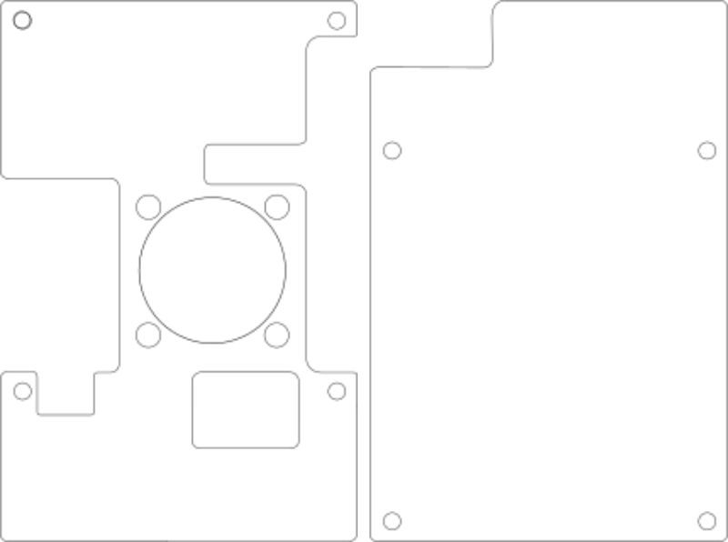

# Kakip用のアクリルカバー
先日発売されたRenesasのRZ/V2Hを搭載したSBCKakipのためのアクリルカバーを作りました。

## 組み立て
SVGファイルはつぎのものをダウンロードできるのでご家庭のレーザー加工機で切り出してください 
Kakipのアクリルカバーを設計したので配布します。[SVGファイル](/files/Cover.zip)

適当なスペーサとファンを購入して組み立てます。KakipとTOP板の間に設置するスペーサは、イーサーネットやRJ45のコネクタの背の高さより高いものを購入してください。

ファンは25mm角のものを購入してください。あんま厚みがあるものを購入するとファンが基板上のICに干渉する必要があるので注意してください。

## 部品の購入
アクリル板以外にカバーの組み立てに必要なものはAmazonで購入できます。今回のカバー制作に利用したものは以下のリンクから購入できます。
- [アクリル板](https://www.amazon.co.jp/gp/product/B09H1ZJ16T/ref=ppx_yo_dt_b_asin_title_o00_s00?ie=UTF8&psc=1)4mmのものが強度があっていいと思います。
- [スペーサ](https://www.amazon.co.jp/gp/product/B07TQLJN3G/ref=ppx_yo_dt_b_asin_title_o00_s00?ie=UTF8&psc=1)：M2.5なら何でもいいです。
- [25mmファン](https://www.amazon.co.jp/gp/product/B09L648CFZ/ref=ppx_yo_dt_b_asin_title_o00_s00?ie=UTF8&psc=1)：25mmファンはファンなら何でもいいと思います。リンクの商品はのコネクタが合わず、自らかコネクタをつけています。

